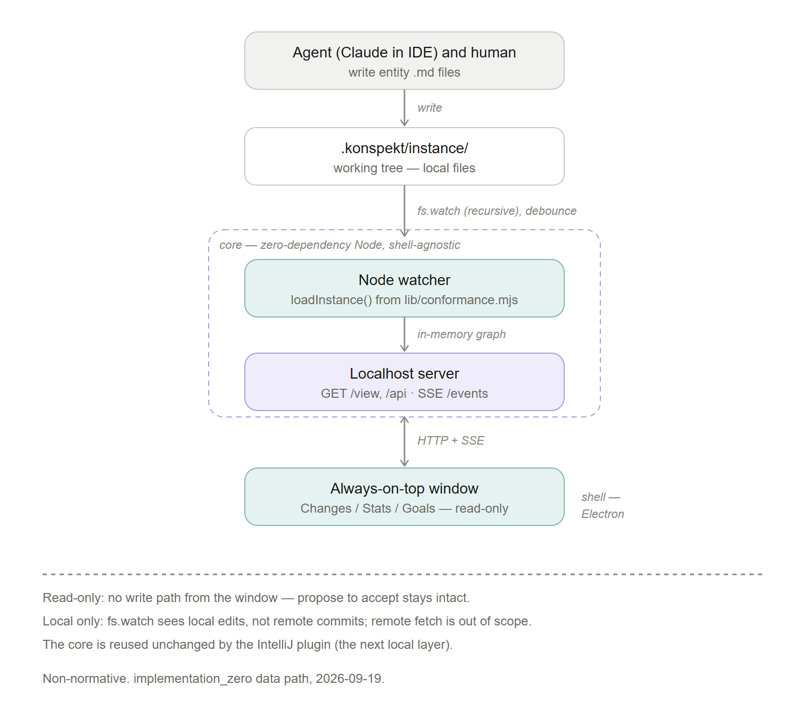

# implementation_zero — local watcher and floating read-only view

Design for the first konspekt UI implementation. Non-normative: `spec/` governs
on any conflict, and nothing here constrains another implementer. The graph
records the work as `task-implementation-zero` and the build order as
`nw-implementation-layering` in `.konspekt/instance/`.

## What it is

A standalone process that runs beside the IDE, watches `.konspekt/instance/` on
the local filesystem, and renders the one konspekt HTML view (`task-konspekt-ui-app`)
in an always-on-top window. It is **read-only**: it reflects the working tree as
the agent and human write to it and takes no disposition, so `propose→accept`
holds because nothing writes.

## Components

The design splits into a shell-agnostic core and a shell.

**Core — zero-dependency Node.** Two parts in one process:

- **Watcher.** `fs.watch` (recursive) over `.konspekt/instance/`. A `sync`
  writes many files at once and a rename arrives as create+delete
  (`nw-rename-fires-as-creation`), so the watcher debounces a burst (~200 ms)
  and then re-runs `loadInstance()` from `lib/conformance.mjs` — the one shared
  reader the checker, `tools/`, and the visual explorer already use, so there is
  no second parser. Full reload is chosen over incremental patching because the
  load is cheap at this instance size and incremental diffing would reintroduce
  the parser rules the shared reader already owns.
- **Localhost server.** Serves the view at `GET /view`, the entities at
  `GET /api`, and a change signal over Server-Sent Events at `GET /events`. The
  SSE payload carries the fact of change; the page then re-reads `/api`. This is
  the sanctioned last hop: `nw-poll-is-the-floor-push-is-optional` places the
  view's feed outside the storage interface and names "server-sent events or a
  poll" as the mechanism.

**Shell — always-on-top window (Electron).** A native window that keeps the
localhost view above other windows. Always-on-top is part of this layer for
adoption: a review surface that stays visible beside the chat session is used, one
behind other windows is not. The core does not depend on the shell — the same
localhost view opens in any browser — so the shell is a packaging choice layered
on top, not a dependency of the data path. The shell is packaged with Electron
(see Decision below).

## Decisions

- **Read-only for zero.** No R/W API, no compare-and-swap, no write path from the
  window. Writes and the authority verbs are a later layer (`task-task-workthrough-ui`),
  and the IntelliJ plugin (`task-intellij-plugin`) is where local writes arrive
  first because it runs in-process.
- **One view behind a transport adapter** (`nw-one-view-two-transports`). Here
  the transport is local HTTP + SSE. The same view and its disposition logic are
  reused by later shells so semantics do not drift.
- **Core reused by the IntelliJ plugin.** The watcher and server logic stay
  Electron/Tauri-agnostic so the next local layer consumes them unchanged.

## Scope

In: the watcher, the localhost server, SSE, and the read-only view over the live
working tree, feeding the Changes / Stats / Goals tabs with real entities.

Out: writes and the authority verbs; remote fetch (local `fs.watch` sees local
edits, not remote commits — `nw-poll-is-the-floor-push-is-optional`); the MCP
`ui://` card (that is the web surface, `task-mcp-app-surface`); and the enterprise
backends (`task-enterprise-persistence`).

## Decision — Electron shell

The always-on-top shell is packaged with Electron: pure JavaScript, one artifact
bundling Node and Chromium, and `alwaysOnTop: true` as a single window flag — the
lowest adoption friction for a first local build. The cost is binary size; Tauri
(OS webview, no bundled Chromium) is the smaller-footprint alternative if size
later matters. The core stays Electron-agnostic and runs in any browser, so the
IntelliJ plugin (JCEF) reuses it unchanged. Recorded as `nw-electron-shell`.

## Layout

- `docs/` — this design and `architecture.svg` / `architecture.png` (the PNG is a
  2x raster export of the SVG; regenerate from the SVG rather than editing it).
- `app/` — the implementation code (not yet built).
